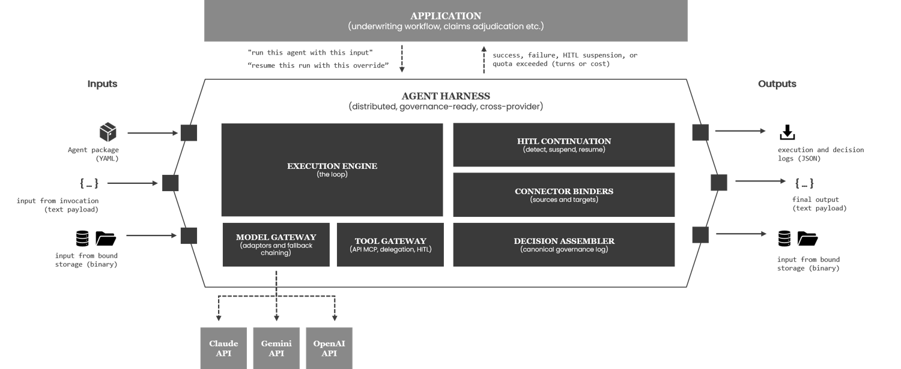

# Multi-Provider Agent Harness

A runnable agent **execution engine** — Claude primary, OpenAI / Gemini fallback
— built to be adopted into the Verity governance platform. It owns the agentic
loop client-side, normalises every provider behind a single neutral IR, and routes
every external effect through a gateway with a mock/suppress seam. The result is a
system that is **provider-independent**, **step-debuggable**, and
**deterministically reproducible**.

---

## The one idea

**Every external effect goes through a gateway, and every gateway has a
mock/suppress seam.** A run only ever touches the outside world in four ways —
model call, tool call, source read, target write — so there are exactly four
gateways:

| Gateway | Effect | Mock seam | Suppress seam |
|---|---|---|---|
| **Model** | LLM inference | replay recorded turns | — |
| **Tool** | tool / MCP call | canned tool responses | auth-deny |
| **Source** | read an input | canned source values | — |
| **Target** | write an output | replay a write handle | shadow/challenger no-op |

Two payoffs fall out of this single idea:

1. **Provider independence.** The loop reads only a neutral IR, so Claude, OpenAI,
   Gemini, and the mock are interchangeable behind one interface. A fallback chain
   across providers is just the model gateway trying links in priority order.

2. **Audit reproduction is free.** "Reproduce decision X" is not a bespoke feature
   — it is all four gateways in playback mode at once. The same mock/suppress
   mechanism used in tests drives exact reproduction of any recorded run.

---

## Key highlights

- **Provider-agnostic loop** — `ModelChain` retries within a link (full-jitter
  backoff on 429/5xx) and falls through to the next provider on exhausted retries
  or fatal errors. Claude → OpenAI → Gemini in the flagship package.
- **Neutral IR** — `TextBlock`, `ThinkingBlock`, `ToolUseBlock`, `ToolResultBlock`,
  `ImageBlock`, `DocumentBlock`. Provider adapters translate to/from wire format;
  the loop never sees vendor objects.
- **Multimodal sources** — `as_block: document` in a source binding fetches bytes
  from S3 and attaches them natively (Anthropic document block / Gemini
  inline_data). Classify a PDF with one line of YAML.
- **HITL suspend/resume** — a gated tool serialises the full loop state (neutral
  `messages`, pending tool use, mock context) to a durable store, releases the
  worker, and resumes on any worker after a human decision. No resources held
  while the human thinks.
- **Delegation** — `delegate_to_agent` is a first-class builtin that re-enters the
  loop at depth + 1. Each sub-agent writes its own decision record with
  `parent_decision_id` set.
- **Decision logging** — the assembler accumulates a 31-field governance record
  throughout a run. `model_invocations.jsonl` records every model turn for replay.
  FileSink (default) writes the ADR-0015 artifact layout; PostgresSink is a
  one-line swap.
- **Postgres worker** — `SKIP LOCKED` claim loop; N workers process N rows
  concurrently with no coordination beyond the database row lock.
- **Deterministic reproduction** — `harness.cli reproduce <run_id>` loads
  `model_invocations.jsonl` and replays the run with all four gateways in
  playback mode.

---

## Architecture



Cross-cutting (policy applied inside the loop, not effects): **quota enforcer**
(before each model call), **HITL gate** (before a gated tool runs), **delegation**
(builtin tool that re-enters the loop), **tracer** (passive observer that emits a
structured event at every stage).

| Component | File | Responsibility |
|---|---|---|
| Neutral IR | `core/ir.py` | `Message`, content blocks, `ToolDef`, `ModelResponse`, `Usage`, `StopReason` |
| Package | `core/package.py` | unsigned YAML analog of `.vax`/`.vtx` |
| Engine | `core/engine.py` | loop, task path, delegation, HITL suspend/resume |
| Model chain | `providers/base.py` | priority fallback + retry-with-full-jitter |
| Provider adapters | `providers/{anthropic,openai,gemini,mock}_provider.py` | IR ↔ vendor wire format |
| Tool gateway | `tools/gateway.py` | auth enforcer → mock seam → transport routing |
| Connectors | `connectors/{base,postgres,s3}.py` | Category B data access |
| Binder | `connectors/binder.py` | source resolution + target writes + suppression |
| MCP client | `mcp/client.py` | stdio + Streamable HTTP, normalised results |
| HITL | `hitl/continuation.py` | durable suspend/resume checkpoint |
| Quota | `quota/enforcer.py` | per-run turn/token/cost ceilings |
| Decisions | `decisions/assembler.py` | record assembly + File/Postgres sinks |
| Mock context | `mock/context.py` | one object that flips all four gateways |
| Tracer | `core/trace.py` | Rich step-debuggable event stream |
| Worker | `worker/worker.py` | Postgres SKIP LOCKED claim loop |

---

## Quick start

```bash
cp .env.example .env        # fill in at least one provider key
pip install -r requirements.txt
```

### Option A — Interactive demo app (recommended)

```bash
./run_demo
```

A menu-driven TUI (`InquirerPy` + `Rich`) that handles everything without
remembering any flags:

```
  status        Show Docker service health
  up            Start the Docker stack (infra only or full stack)
  down          Stop the stack (keep or wipe volumes)
  seed          Upload demo documents to MinIO
  run           Pick a scenario, set options, execute
  runs          Browse decision logs and model turns
  logs          Tail a service log
  suspensions   Browse and action HITL suspensions
  quit
```

Typical first session:

1. **up → full stack** — starts Postgres, MinIO, MCP server, worker, JupyterLab
2. **seed** — uploads `samples/complaint.txt` to MinIO
3. **run → classify** — classifies the complaint document
4. **run → underwriting_bind (auto-approve)** — full COPE workflow, HITL, bind
5. **run → underwriting_refer** — refer path, no HITL
6. **runs** — inspect the decision logs and model turns
7. **down** — stop the stack

### Option B — Jupyter notebook (cell-by-cell walkthrough)

Start the Docker stack once (`./run_demo → up → full stack`), then open:

```
http://localhost:8888
```

Open `notebooks/walkthrough.ipynb`. Each section is a self-contained
executable cell: package explorer, data explorer, classify task, underwriting
refer, underwriting bind + HITL widget.

### Run the test suite (no keys, no infra)

```bash
PYTHONPATH=$PWD python tests/test_engine.py     # or: pytest -q
```

### Inspect decision artifacts

```
_artifacts/runs/YYYY/MM/DD/<run_id>/
    decision_log.json          # full governance record (31 fields)
    model_invocations.jsonl    # one line per model turn (drives replay)
```

### Reproduce a past run deterministically

```bash
python -m harness.cli reproduce <run_id>        # replays its recording, no live API call
```

---

## Repo layout

```
run_demo       Interactive TUI — primary entry point (menu-driven)
harness/
  core/        ir.py · package.py · engine.py · result.py · trace.py · factory.py
  providers/   base.py (chain) · anthropic_/openai_/gemini_/mock_provider.py
  tools/       gateway.py (auth + routing) · python_tools.py
  connectors/  base.py · postgres.py · s3.py · binder.py
  mcp/         client.py (stdio + Streamable HTTP)
  hitl/        continuation.py (durable suspend/resume)
  quota/       enforcer.py
  decisions/   assembler.py (record + File/Postgres sinks)
  mock/        context.py (one object, four gateway seams)
  worker/      worker.py (Postgres SKIP LOCKED claim loop)
  cli.py       Programmatic CLI: run · enqueue · worker · resume · reproduce · list-suspensions
demo/          TUI app backing run_demo (InquirerPy menus, log viewers)
packages/      classify_document.task.yaml · underwriting_agent.agent.yaml · loss_history_analyst.agent.yaml
mcp_servers/   example_server.py (FastMCP; stdio + http)
scripts/       demo_app.py (rate_property, bind_policy) · seed_demo.py
notebooks/     walkthrough.ipynb — cell-by-cell engine walkthrough in JupyterLab
docker/        Dockerfile · docker-compose.yml · initdb/01_schema.sql
specs/         ADR-COMPATIBILITY.md · INTEGRATION.md
tests/         test_engine.py
```

---

## The three example packages

- **`classify_document`** (task) — fetches a document from MinIO as a binary
  block (`as_block: document`), attaches it natively to the model (Anthropic
  document block / Gemini inline_data), and returns a structured classification.
  Demonstrates multimodal source binding and S3 target write.
- **`underwriting_agent`** (agent) — the flagship: a Postgres source (COPE
  submission row), python tools (`rate_property`, `bind_policy`), MCP tools
  (`property_data`, `lookup_appetite`), delegation to `loss_history_analyst`, a
  HITL gate on `bind_policy`, an S3 target write, and a Claude→OpenAI→Gemini
  fallback chain. Two scenarios: bind (Chicago restaurant) and refer (Tampa
  warehouse).
- **`loss_history_analyst`** (agent) — the delegation target; calls `pull_loss_runs`
  via MCP and writes its own decision record at depth 1 with `parent_decision_id`
  pointing to the parent run.

---

## Learning the codebase

The [`docs/`](docs/) directory contains eleven modules that walk through every
layer of the engine with ASCII diagrams and checkpoint questions:

| Module | Topic |
|---|---|
| [00 — Index](docs/00-index.md) | Prerequisites and reading order |
| [01 — Orientation](docs/01-orientation.md) | Repo layout, entry points |
| [02 — Neutral IR](docs/02-ir.md) | Content blocks, `ModelResponse`, `ToolDef` |
| [03 — Packages](docs/03-packages.md) | YAML schema, task vs agent, bindings |
| [04 — Execution engine](docs/04-execution-engine.md) | Loop stages, delegation, HITL gate, quota |
| [05 — Providers and chain](docs/05-providers-and-chain.md) | Adapters, retry/fallthrough, full-jitter backoff |
| [06 — Tool gateway](docs/06-tool-gateway.md) | Auth enforcement, mock seam, three transports |
| [07 — Connectors](docs/07-connectors.md) | Binder, `as_block` path, Postgres and S3 |
| [08 — HITL](docs/08-hitl.md) | Suspend/resume lifecycle, three human decisions |
| [09 — Decision log](docs/09-decision-log.md) | Assembler accumulation, FileSink layout, replay |
| [10 — Worker](docs/10-worker.md) | SKIP LOCKED claim loop, state machine, retry |
| [11 — End-to-end](docs/11-end-to-end.md) | Full underwriting run traced through every layer |
| [A01 — Agent loop basics](docs/appendix-01-agent-loop-basics.md) | Basics of agentic AI execution |
| [A02 — Async python](docs/appendix-02-async-python.md) | Python async execution |
| [A03 — COPE underwriting](docs/appendix-03-cope-underwriting.md) | COPE rating framework, binding vs. referral, worked examples from both demo scenarios |

For operational tasks (seeding MinIO, running demos, checking artifacts,
reproducing a run): **[Runbook](docs/runbook.md)**.

---

## Debugging

The Rich tracer turns every loop stage into a structured event (indentation =
delegation depth). In `./run_demo → run`, toggle the **step** option to pause after
each model turn. In the notebook (`notebooks/walkthrough.ipynb`), cells execute
one stage at a time — the best way to inspect the neutral IR mid-run. For
source-level debugging, set a breakpoint in `harness/core/trace.py:Tracer.emit`
or in any gateway — you stop with the full neutral IR state in scope, no vendor
objects in the way.

---

## Scope notes

- **Distributed plane is stubbed** (ADR-sanctioned): the worker uses the Postgres
  `SKIP LOCKED` fallback that ADR-0015 explicitly preserves. NATS / coordinator /
  mTLS / island mode are not built. See [`specs/ADR-COMPATIBILITY.md`](specs/ADR-COMPATIBILITY.md).
- **Sub-agent HITL is out of scope** — a synchronous delegation would block the
  parent worker for human-time; lifting it needs async delegation. See
  [`specs/INTEGRATION.md §6`](specs/INTEGRATION.md).
- **Provider adapters** target current SDK shapes with defensive parsing. They are
  exercised live via Docker with keys; the container has no vendor network access,
  so only the mock path is locally verifiable.
- **Reproduction** is bit-exact for single-shot task recordings. Delegating /
  suspending agents record per-segment; tree replay is a roadmap item.

## License
AGPL-3.0 — see [LICENSE](LICENSE).